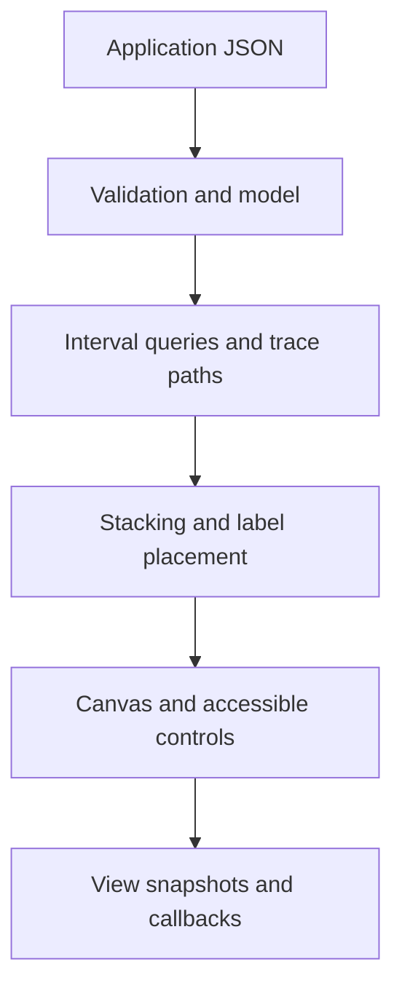

# Architecture and ownership

`createTimeline` mounts an `EventTimeline` inside an open Shadow DOM. Applications supply JSON, subscribe to copied event payloads, and dispose the instance on unmount. The library has no runtime dependency and no backend.

| File | Responsibility | Change it when |
|---|---|---|
| `src/types.ts` | Public contracts | Adding an API or additive saved-view field |
| `src/core.ts` | JSON validation, interval index, group expansion, graph traversal and explanations | Changing model semantics |
| `src/layout.ts` | Per-lane interval coloring and label suppression | Changing overlap handling |
| `src/history.ts` | Bounded copied snapshots and gesture coalescing | Changing undo behavior |
| `src/timeline.ts` | Rendering, sticky pins, controls, hit targets, input, lifecycle | Changing interaction or appearance |
| `scripts/bundle.mjs` | Script-tag IIFE build | Changing distribution format |
| `examples/python/event_lanes.py` | Python record boundary | Changing Python conversion |

Core imports never require a DOM. TypeScript compilation emits ESM/declarations/maps. esbuild emits `dist/event-lanes.global.js`. The package exposes the DOM-free core separately. The public repository uses generic examples; the private demo is a consumer, with its own synthetic data and analysis exports.

Rendering queries intervals intersecting the viewport. Above the density threshold it bins events per lane; otherwise it stacks overlapping event geometry. Selected trace overlays are bounded by the threshold. Label placement gives selected/trace labels priority, suppressing collisions while preserving geometry, tooltips and the accessible list. This is deterministic placement, not global aesthetic optimization.

Lane ordering applies within each lane group. Up to three requested pins can be fixed above the scrolling rows; pins that do not fit while leaving one ordinary row fall back to the normal list. Filters/search still apply to pinned lanes. Hidden selection survives filters. `focusEvent` can refuse a filtered event; application reveal controls clear restrictions explicitly.

Saved views contain time range, selection, filters, collapsed lane groups and optional lane/trace/scroll state. Unlimited depth is `null` in JSON. History stores at most 100 views, coalesces nearby viewport/scroll changes, and clears on dataset replacement. It never stores copies of the dataset or promises rollback of external state.

When adding a new view field, update its validator, snapshot restoration, history and compatibility docs together. Validate before mutating. Rendering changes require browser acceptance, model changes require appropriate pure tests, and benchmarks are evidence rather than pass/fail speed promises.
