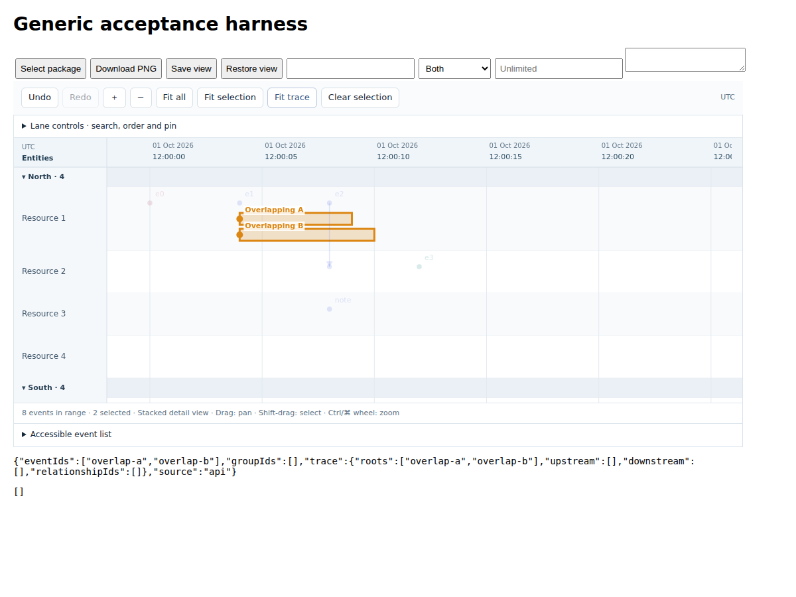

# Documentation map

Start with the [quickstart](QUICKSTART.md) to embed this timeline in your own application. The screenshot uses synthetic, domain-neutral data; [capture details](images/README.md) describe how to refresh it.

| Goal | Read / run |
|---|---|
| First integration | [Quickstart](QUICKSTART.md), `examples/quickstart/` |
| Understand JSON | [Data modeling guide](DATA_MODEL.md), `schema.json`, `src/types.ts` |
| Feed Python / DataFrames | [Python walkthrough](PYTHON.md), `examples/python-server/` |
| Choose methods and options | [API](API.md) |
| Common integration tasks | [Recipes](RECIPES.md) |
| Diagnose surprising behavior | [Troubleshooting](TROUBLESHOOTING.md) |
| Modify the library | [Architecture](ARCHITECTURE.md), `../AGENTS.md` |
| Know compatibility and install a release | [Releases](RELEASES.md), `../CHANGELOG.md` |
| Assess measured scale | [Performance](PERFORMANCE.md) |
| Know what has been tested | [Validation](VALIDATION.md) |
| Test whether an agent understands it | [Cold-start exercise](COLD_START.md) |

Start with the quickstart; read the data modeling guide before converting real records. The library displays the relationships supplied by your application. It does not discover relationships, repair schedules, authenticate backend calls, or determine whether a causal assertion is true.
